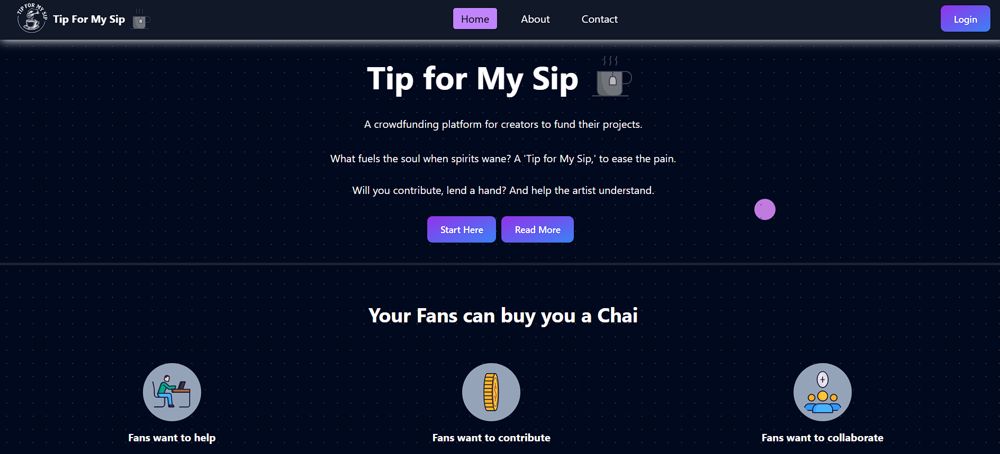
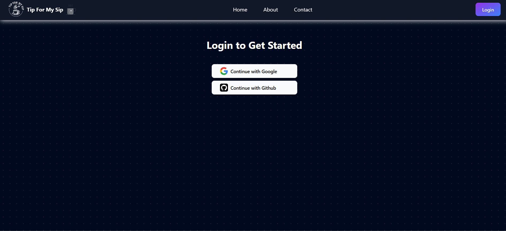
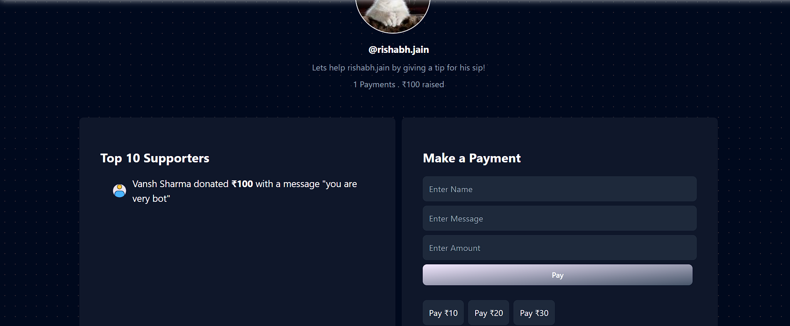

# ☕ Tip For My Sip

**Tip For My Sip** is a creator support platform where fans can send small tips to their favorite creators — whether it's the price of a coffee or a kind word of encouragement. Inspired by platforms like GetMeACofi, this web app is built using the MERN stack and provides a seamless user experience for supporting creators with instant payments and personalized messages.

---

## 🌟 Features

- 🔐 User authentication and session handling
- 🧾 Creator profile pages with custom links
- 💬 Personalized message with each tip
- 💳 Integrated Razorpay payment gateway
- 📱 Responsive UI with Tailwind CSS
- 🧠 Modern animations using Framer Motion
- 📊 Dashboard to track tips and activity
- 💼 Admin functionality for creators
- 🛡️ Secure backend with validation and error handling

---

## 🛠️ Tech Stack

**Frontend:**
- React.js
- Tailwind CSS
- Framer Motion
- Axios

**Backend:**
- Node.js
- Express.js
- MongoDB (Mongoose)
- Razorpay API

**Other Tools:**
- Git & GitHub
- Postman (for API testing)
- dotenv for config management

---

## 🚀 Getting Started

### 🔧 Prerequisites

- Node.js & npm
- MongoDB (local or Atlas)
- Razorpay developer account

### 📦 Installation

```
# Clone the repo
git clone https://github.com/your-username/tip-for-my-sip.git
cd tip-for-my-sip
```

# Install backend dependencies
```
cd backend
npm install
```

# Install frontend dependencies
```
cd ../frontend
npm install
```

🔐Environment Variables
Create a .env file in both /backend and /frontend directories.

Backend .env:
```
PORT=5000
MONGO_URI=your_mongo_connection_string
RAZORPAY_KEY_ID=your_razorpay_key
RAZORPAY_KEY_SECRET=your_razorpay_secret
```

Frontend .env:
```
REACT_APP_API_BASE_URL=http://localhost:5000
REACT_APP_RAZORPAY_KEY_ID=your_razorpay_key
```

▶️ Running the App

# Run backend
```
cd backend
npm run dev
```

# Run frontend
```
cd ../frontend
npm start
```
🖼️ Screenshots
### 🔹 Homepage


### 🔹 Authentication


### 🔹 Tip Confirmation


🙋‍♂️ Creator
Rishabh Jain
💻 B.Tech CSE | MERN Stack Developer
📧 rishabh.jain.en@gmail.com
🔗 [LinkedIn](https://linkedin.com/in/rishabhj26) | [GitHub](https://github.com/RishabhJ-26)

📜 License
This project is licensed under the MIT License.

🤝 Support
If you like this project, feel free to ⭐ star it and share it with others! Contributions, feedback, and suggestions are always welcome.
